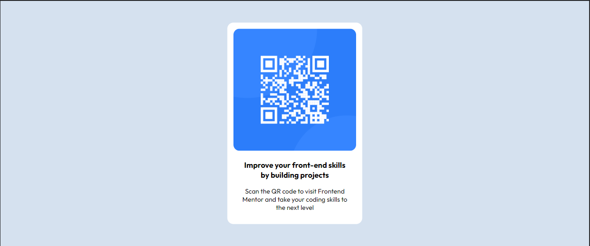

# Frontend Mentor - QR code component solution

This is a solution to the [QR code component challenge on Frontend Mentor](https://www.frontendmentor.io/challenges/qr-code-component-iux_sIO_H). Frontend Mentor challenges help you improve your coding skills by building realistic projects. 

## Table of contents

- [Overview](#overview)
  - [Screenshot](#screenshot)
  - [Links](#links)
- [My process](#my-process)
  - [Built with](#built-with)
  - [Useful resources](#useful-resources)
- [Author](#author)

## Overview

### Screenshot

### Links

- [Solution URL](https://www.frontendmentor.io/solutions/responsive-qr-code-component-using-html-and-css-PbPkpug2_V)
- [Live Site URL](https://hunianad.github.io/QR-code-component/)

## My process

### Built with

- Semantic HTML5 markup
- CSS custom properties
- Mobile-first workflow

### Useful resources

- [Example resource](https://blog.hubspot.com/website/center-div-css) - This helped me in positioning content at the center of the screen.

## Author

- Frontend Mentor - [@HuniaNad](https://www.frontendmentor.io/profile/HuniaNad)
- LinkedIn - [@Hunia Nadeem](https://www.linkedin.com/in/hunianadeem/)
